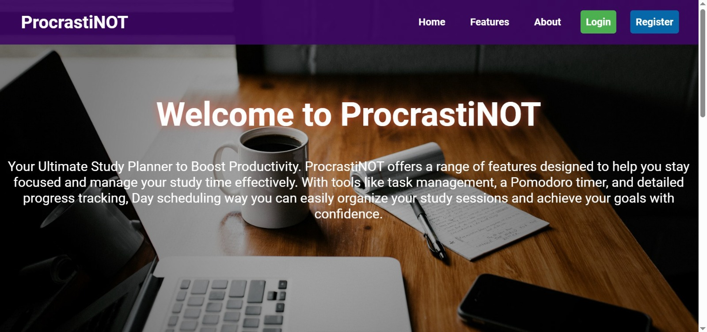

🧠 Procrastinot – Virtual Study Planner

Procrastinot is a virtual study planner designed to help students and professionals overcome procrastination and stay focused. It combines intelligent scheduling, a built-in Pomodoro timer, task management, and personalized study tips — all in one platform.

With a clean, distraction-free interface and productivity-driven features, Procrastinat empowers users to manage their time efficiently and achieve their goals with consistency.

🚀 Features

⏱️ Pomodoro Timer – Stay productive with focused study sessions and timed breaks.
🗓️ Smart Scheduler – Plan study sessions, track progress, and organize daily tasks easily.
✅ Task Management – Add, edit, and prioritize study or work tasks.
💡 Study Tips Dashboard – Get AI-generated motivation and focus tips.
📊 Progress Tracker – Visualize daily, weekly, and monthly achievements.
🌙 Dark/Light Mode – Switch themes to match your study mood.
👤 User Accounts – Sign up, log in, and securely store your progress.
📱 Responsive UI – Works seamlessly across desktop, tablet, and mobile devices.

🛠️ Tech Stack

Frontend: HTML, CSS, JavaScript

Backend: Python (Django Framework)

Database: SQLite

Additional Tools: Django Templates, Bootstrap/Tailwind CSS, Chart.js for analytics

📸 Screenshots

Key screens from the Procrastinot experience:

🏠 Homepage – Clean dashboard with quick access to timer and today’s schedule.
⏱️ Pomodoro Page – Customizable timer with task association.
📅 Planner View – Interactive calendar to organize and reschedule study blocks.
📊 Progress Tracker – Graphs showing productivity statistics and achievements.
---

## 📸 Screenshots

> Key screens from the Procrastinot user experience:

### 🏠 Homepage
  

---
